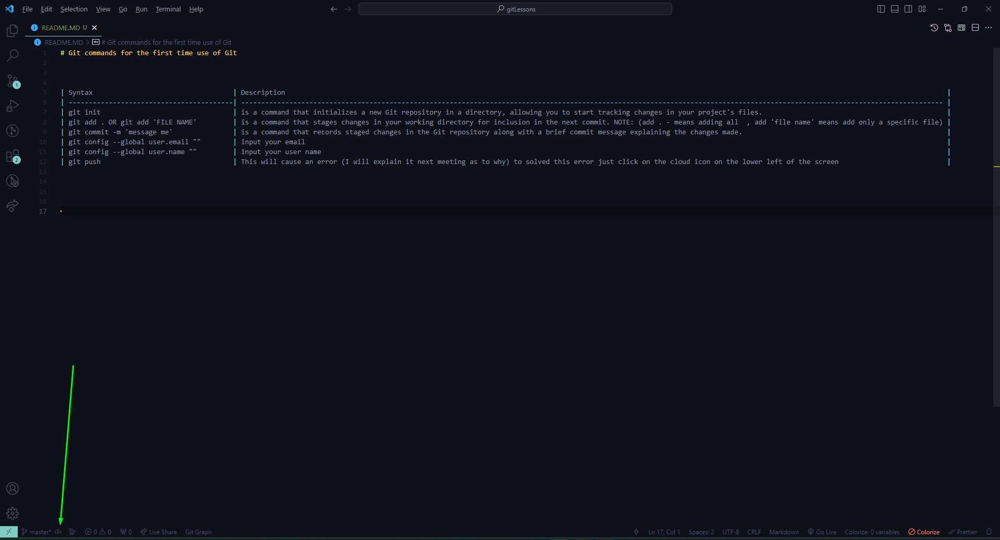
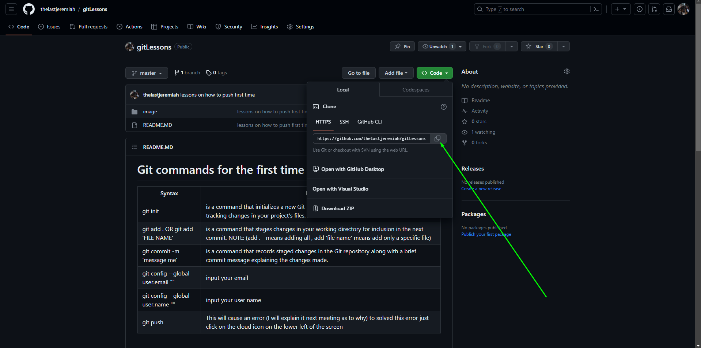
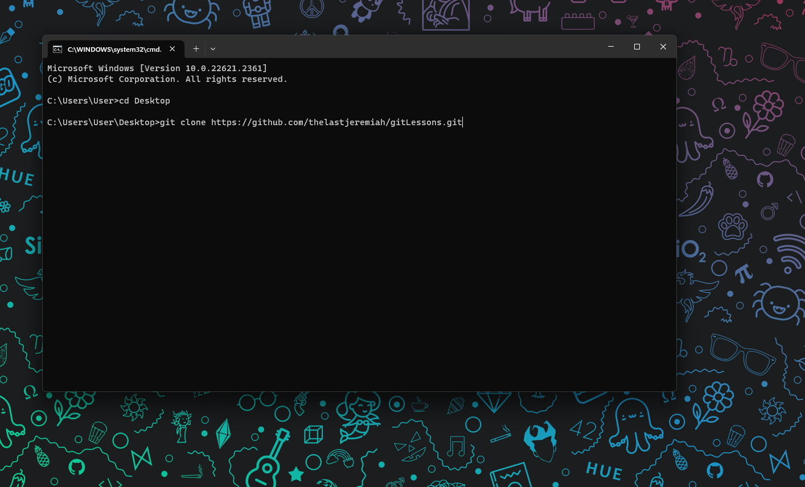

# Git commands for the first time use of Git 


| Syntax                                   | Description                                                                                                                                                                     |
| -----------------------------------------| ------------------------------------------------------------------------------------------------------------------------------------------------------------------------------- |
| git init                                 | is a command that initializes a new Git repository in a directory, allowing you to start tracking changes in your project's files.                                              |
| git add . OR git add 'FILE NAME'         | is a command that stages changes in your working directory for inclusion in the next commit. NOTE: (add . - means adding all  , add 'file name' means add only a specific file) |
| git commit -m 'message me'               | is a command that records staged changes in the Git repository along with a brief commit message explaining the changes made.                                                   |
| git config --global user.email ""        | input your email                                                                                                                                                                |
| git config --global user.name ""         | input your user name                                                                                                                                                            |
| git push                                 | This will cause an error (I will explain it next meeting as to why) to solved this error just click on the cloud icon on the lower left of the screen                           |

<br>




## Other syntax used on the lessons 


|  #      | Description                                                                                                                                                           |
| ------- | ----------------------------------------------------------------------------------------------------------------------------------------------------------------------|
| mkdir   | to create a folder using only command lines                                                                                                                           |
| dir     |  is a command used to list the files and directories in the current directory. (Note: you must be using CMD on this)                                                  |
| ls      | is a command used to list the files and directories in the current directory. (Note: you must be using GitBash or Linux termnial on this)                             |
| cd .    | is used to change the current directory to its own current directory                                                                                                  | 
| cd ..   | is used to navigate up one directory level from the current directory.                                                                                                | 
| cls     | command is used to clear the terminal screen, providing a clean workspace for entering new commands. (Note: you must be using CMD on this )                           | 
| clear   | command is used to clear the terminal screen, providing a clean workspace for entering new commands. (Note: you must be using Git bash or Linux Terminal on this )    | 


<Br>

# How to clone from git Repository

|  #      | Description                                               |
| ------- | --------------------------------------------------------- |
| Note: 1 | For this to work you must first have a working repository |
| Note: 2 | Be sure that you are on the Desktop directory             |


<br>

```
Copy the git URL
```




```
Paste the git url on a terminal NOTE: Use CMD 
```



```
The command should go something like this
```

```
git clone https://github.com/thelastjeremiah/gitLessons.git
```

